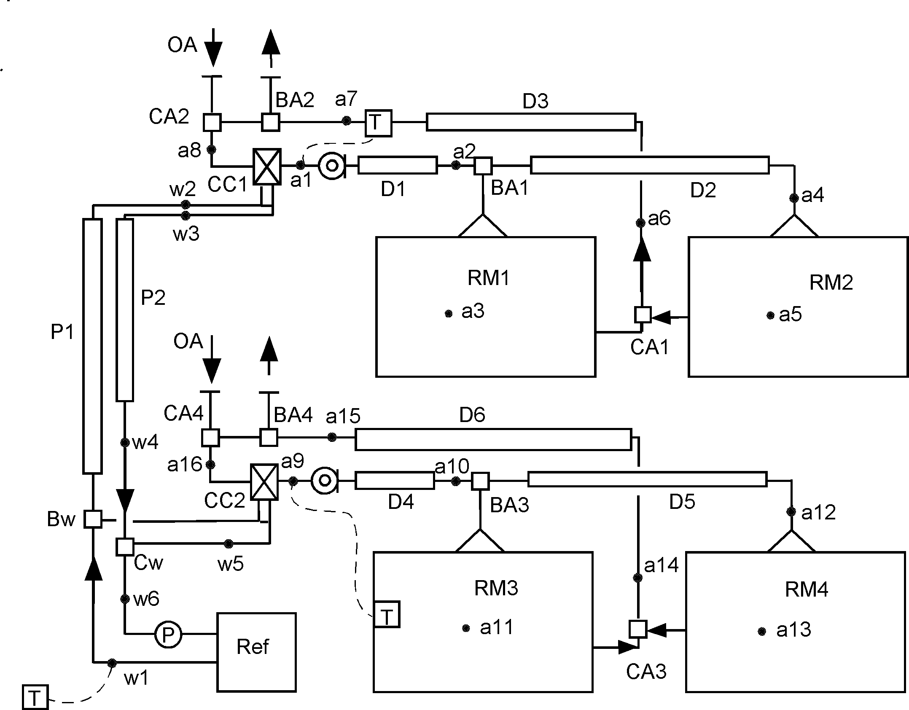

### 1.1 適用可能システム

建築の熱負荷シミュレーションおよび空調・給湯設備システムシミュレーションを対象としており、両者をそれぞれ単独にシミュレートすることもできるし、一体のシステムとして総合的なシミュレーションを行うこともできる。たとえば、建物の自然室温計算や通常の空調・暖房システムをしない熱負荷シミュレーションも可能であり、太陽熱給湯システムのように設備システムのみを対象とすることも可能である。また、建物と設備と両方が関係する、太陽熱給湯・暖房システムも扱うことができる。

これまでのところシステム内の水や空気の循環量はシミュレーション対象ではなく、システム構成要素各部分の通過流量を計算条件として設定するものである。このため、太陽熱利用システムにおける自然循環集熱方式は対象外である。また、自然換気量計算も対象外である。冷暖房システムについては室内温・湿度、室内表面温度、熱負荷のシミュレーションの他、冷温風による空調システム、放射冷暖房システムを扱うことができる。建物側については、壁、天井、床、窓など建築部位と室構成および室内発熱や換気のスケジュールなど通常の建築熱負荷シミュレーションに必要な情報を入力する。天井放射冷房や床暖房などの放射冷暖房システムは水式、空気式の何れでも扱うことができる。異なる空調方式による空調室あるいは非空調 室が混在していても差し支えない。システムを構成する設備機器は、現在のところ、ヒートポンプ、ボイラー、集熱器、蓄熱槽、

冷温水コイル、熱交換器、配管・ダクト、ポンプ・ファン、VAVユニット、蓄熱式暖房器、弁類である。また、具体的な機器仕様が未定のままでもシステムシミュレーションが可能なように仮想熱源や仮想空調機も用いることができる。仮想熱源や仮想空調機を用いることによりシミュレーション結果を機器容量の検討に用いることもできる。

これらのシステムを構成する設備機器は複数台あってもよく、構成要素機器の接続関係とでシステムを定義するので、自由にシステムを構成することができる。入力データ作成法のルールに従えば、どのようなシステム構成のシミュレーションも可能である。

暖冷房の室内熱環境の設定や室内発熱、換気量に関する条件設定および給湯使用量や給湯温度など給湯負荷に関する条件設定は、時刻ごとの変動をスケジュールデータとして与える方法により設定する。システム各部の冷温水、冷温風の循環流量も同様の方法で時刻ごとに変動させることもできる。このスケジュールは季節、曜日によって日変動スケジュールを変化させる ことも可能であり、極めて柔軟なスケジュールを作成することができる。

機器の制御方法の指定は機器の作動状態の検出と動作条件を入力データとして与えることにより指定する。あらかじめ、制御方法を想定する方法ではないため、シミュレーション結果 を制御方法、制御用データの検出方法の検討に使用することも可能である。

図1.1.1は単一ダクト空調システムの例であり、4室に対して2系統の空調機コイルから冷風が供給され空調が行われる。2台の空調機には冷凍機から冷水が供給される。ダクトた配管 もシステム構成要素としているので、ダクト系、配管系における熱取得も考慮される。また、制御はCC１のコイルについてはリターン空気温度制御、CC2のコイルについては2室のうちの1室RM1の室温により制御される。冷凍機については、冷水の供給温度を制御するものとしてある。

図1.1.1 手風量単一ダクト空調システムの例

図1.1.1の例では、システム構成要素は、以下の通りである。

|  |  |
| --- | --- |
| 室 | RM1, RM2, RM3, RM4 |
| 空調機コイル | CRMC1, CC2 |
| 冷凍機 | Ref |
| ダクト | D1, D2, D3, D4, D5, D6 |
| 分岐ダクト | BA1, BA2, BA3, BA4 |
| 合流ダクト | CA1, CA2, CA3, CA4 |
| 配管 | P1, P2 |
| 分岐配管ヘッダー | Bw |
| 合流配管ヘッダー | Cw |

これらシステム構成要素それぞれについての仕様データおよび構成要素間の関係を表すデータによってシステムが構築される。

システムの構成は自由であり、室数、空調方式など自由に構成することができる。具体的な空調方式を定めずに、室熱負荷のシミュレーションのみを行うこともできる。

