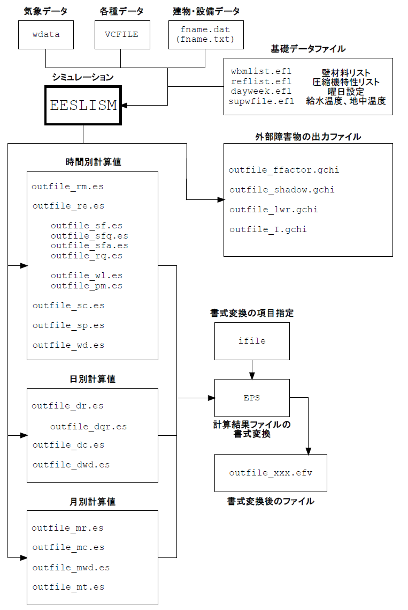

# 1.2 データファイルの構成

図1.2.1にEESLISMにおける入力および出力ファイルの構成を示した。

## 1.2.1 入力ファイル

シミュレーション対象を記述するシステムデータの他に以下のファイルが実行時に入力さ れる。システムデータではシミュレーション行うシステム自体の定義や計算期間、出力ファイ ルの選択など各種設定条件を定義するそれぞれのシミュレーションに固有のファイルである。 これ以外のファイルは、通常、既に用意されているので、一般ユーザーはシステム定義データ のみを作成し、気象データを用意すればよい。また、時間変動データファイル(VCFILE)は 必要なときのみ入力する。

### システムデータファイル

*fname*.dat または *fname*.txt

*fnam*eは任意の名称でよいが、識別子 .datまたは .txt は必ずつける。

建物、設備および外部障害物を記述するデータである。内容は[2.3](./2_3.md)～[2.8](./2_8.md)および[2.10](./2_10.md)に述べる。

### 気象データファイル

*wdata*

HASP形式の気象データファイル。計算時間間隔が1時間未満でシミュレーションを行う場合には、直線補間により1時間未満の気象データを内挿する。気象データはVCFILEデータとして読み込むこともできる。(2.9.2参照)

### 時間変動データファイル

VCFILEデータとして読み込むファイルであり、時刻ごとに変動するデータを各種スケジュールや機器の周囲温度条件などに利用するために入力する。気象データをこの形式で読み込むこともできる。VCFILEデータの書式は出力ファイルに準じている。

1時間以下の計算時間間隔を用いて、シミュレーションを行う場合には気象データは、 VCFILE データファイルから読み込む。

### 組み込みデータ

- *supwfile*.efl・・・給水温度データ。地域ごとの給水温度の月平均値データ。
- *dayweek*.efl・・・曜日、休日指定用データファイル。

## 1.2.2 出力データファイル

シミュレーション結果は全てファイルに出力される。時刻別出力と日集計値出力とがあり、何れも出力内容を分類しているので、複数のファイルを作成する。時刻別ファイルは指定した期間のみ出力するが、日集計値ファイルは、全計算期間について出力される。日集計値ファイルには日積算値、平均値のほか運転時間、最高・最低値および最高・最低値発生時刻も出力される。

出力ファイルは全てASCIIテキストファイルである。ファイル名*outfile*はシステム定義 データ中で定義するが、既定値はシステム定義データと同じ名前である。

### 毎時出力

- 建物シミュレーション結果
  - *outfile*\_rm.es 室温、湿度、室内表面温度、熱負荷
- このほか下記のファイルも指定などにより出力される。

  - *outfile*\_re.es 室温、湿度、平均表面温度、相対湿度
  - *outfile*\_sf.es 室内表面温度
  - *outfile*\_sfq.es 室内表面熱流
  - *outfile*\_sfa.es 室内表面熱伝達率
  - *outfile*\_wl.es 壁体内温度
  - *outfile*\_rq.es 日射および室内発熱、すきま風による熱取得要素
  - *outfile*\_pm.es PMV
- 機器ごとのシミュレーション結果
  - *outfile*\_sc.es 入口・出口水温、各種熱量、エネルギー消費量など
- システム経路に沿った出力
  - *outfile*\_sp.es システム経路に沿った流量、機器出入口温度
- 気象データ
  - *outfile*\_wd.es 外気温、方位別日射量などの気象データ(指定による)
- 外部障害物計算用データ
  - *outfile*\_ffactor.gchi 形態係数
  - *outfile*\_shadow.gchi 日影面積
  - *outfile*\_lwr.gchi 長波長放射
  - *outfile*\_I.gchi 日射量

### 日集計値出力

- 建物シミュレーション結果

  - *outfile*\_dr.es 室温、湿度、室内表面温度、熱負荷日集計値

  - *outfile*\_dqr.es 日射および室内発熱熱取得要素日積算値(指定による)

- 機器ごとのシミュレーション結果

  - *outfile*\_dc.es 入口・出口水温、各種熱量、エネルギー消費量などの日集計値

- 気象データ

  - *outfile*\_dwd.es 気象データ日平均、日積算値(指定による)

### 集計値出力

- 建物シミュレーション結果

  - *outfile*\_mr.es 室温、湿度、室内表面温度、熱負荷月集計値

- 機器ごとのシミュレーション結果

  - *outfile\_m*c.es 入口・出口水温、各種熱量、エネルギー消費量などの月集計値

- 気象データ

  - *outfile*\_mwd.es 気象データ月平均、月積算値(指定による)

### 月・時刻集計値出力

- 機器ごとのシミュレーション結果

  - *outfile*\_mt.es エネルギー消費量の月・時刻集計値

## 1.2.3 基礎データファイル

壁体材料リスト、圧縮機特性リスト、曜日設定、給水温度・地中温度などは基礎データファイルとして、用意してある。基礎データファイルは、文字データファイルであり、追加、修正等が可なものもある。([４章参照](./4_basicdata.md))

## 1.2.4 気象データファイル

気象データファイルは、２種類の入力方法がある。基本的には、5章で述べるようにHASPデータ書式のファイルを入力するが、2.9.2で述べるようにVCFILEデータによって気象データを定義、使用することもできる。

図1.2.1 ファイルの構成
